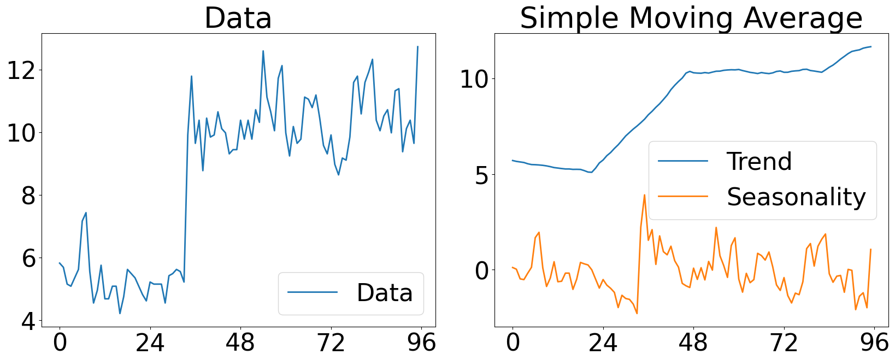
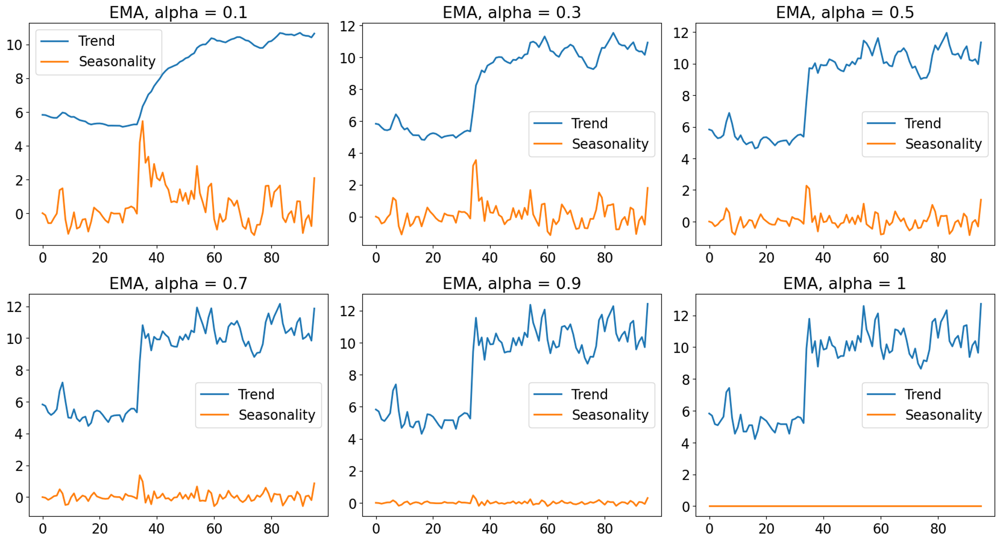
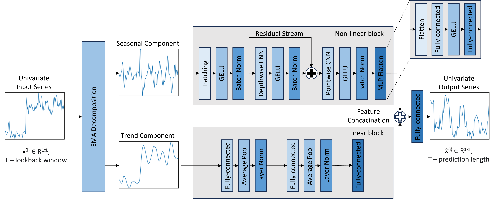
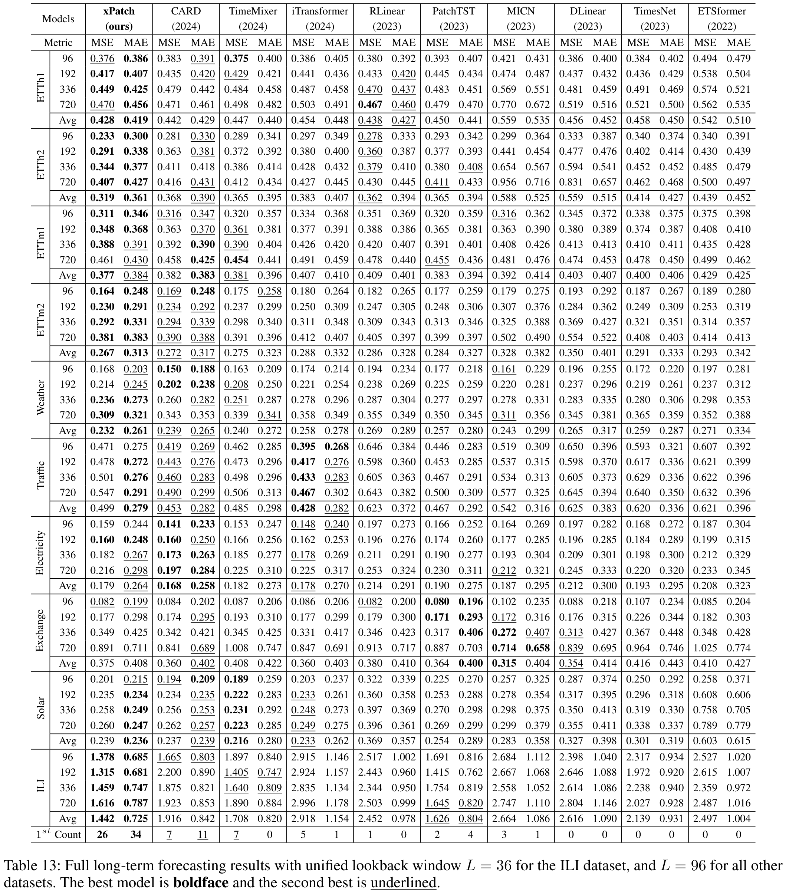
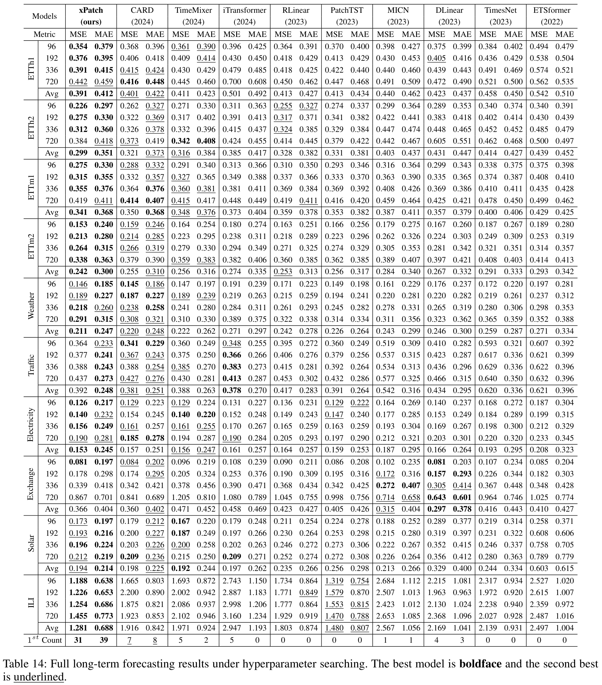
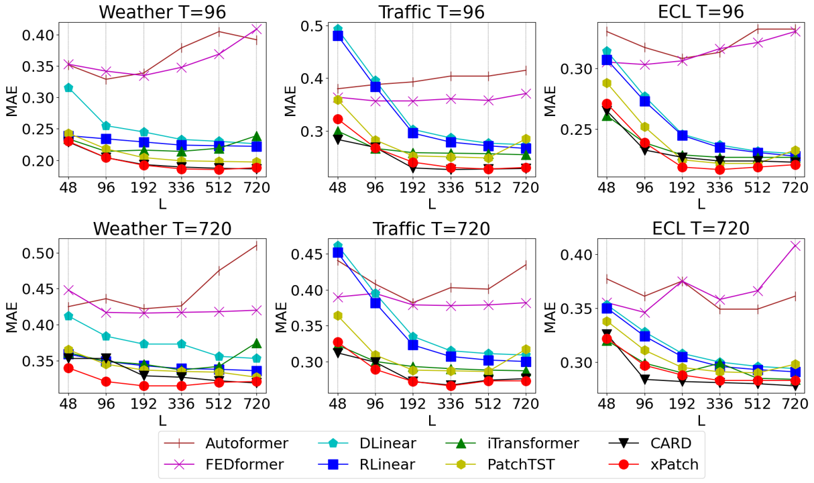
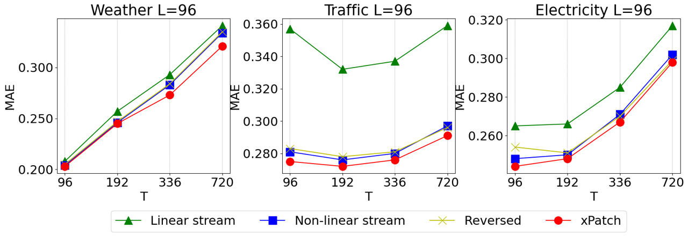
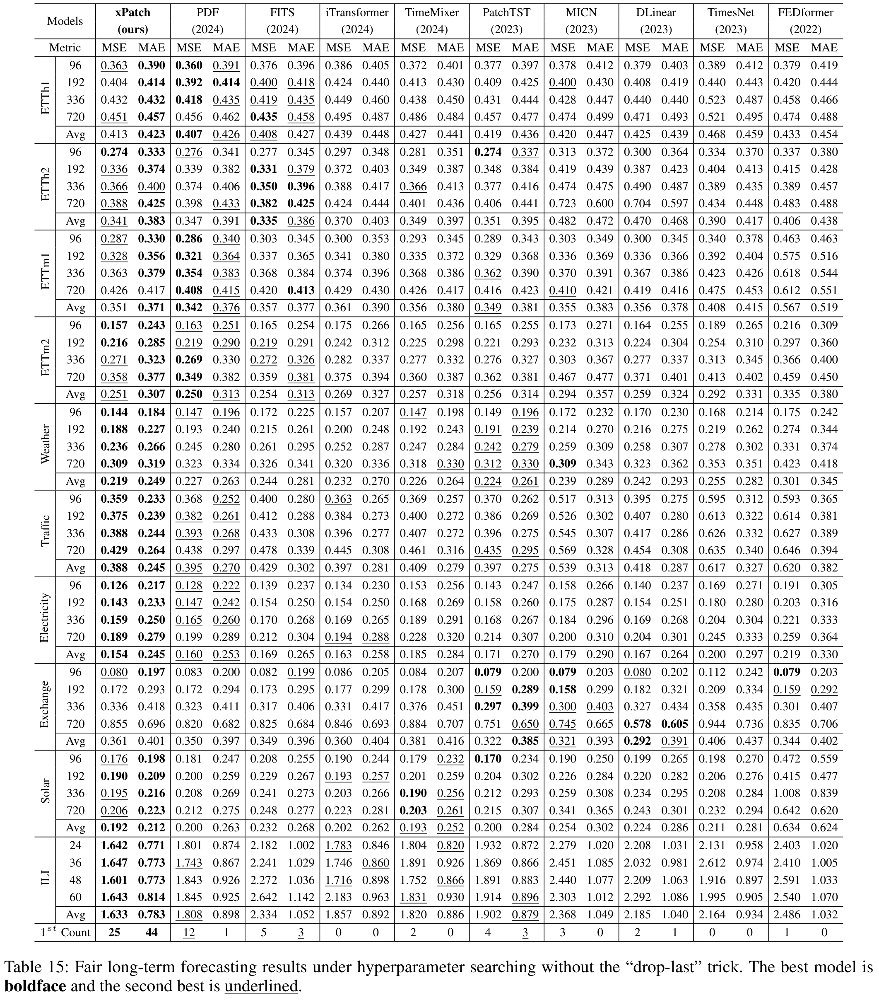

<div align="center">
  <h2><b> (AAAI25) xPatch: Dual-Stream Time Series Forecasting with Exponential Seasonal-Trend Decomposition </b></h2>
</div>

<div align="center">

[](https://arxiv.org/pdf/2412.17323)
[](https://ojs.aaai.org/index.php/AAAI/article/view/34270)


</div>

This is an official implementation of [xPatch: Dual-Stream Time Series Forecasting with Exponential Seasonal-Trend Decomposition](https://arxiv.org/pdf/2412.17323).

## Model Overview

E**x**ponential **Patch** (xPatch) is a novel dual-stream architecture that utilizes exponential decomposition.

### Seasonal-Trend Decomposition

**Simple Moving Average (SMA)** is the unweighted mean of the previous data points.

<p align="center">

</p>

**Exponential Moving Average (EMA)** is an exponential smoothing method that assigns greater weight to more recent data points while smoothing out older data.

<p align="center">

</p>

### Architecture

Dual-flow architecture consists of an MLP-based linear stream and a CNN-based non-linear stream.

<p align="center">

</p>

## Results

### Long-term Forecasting with Unified Experimental Settings

In the unified experimental settings, xPatch achieves the best averaged performance on 60% of the datasets using the MSE metric and 70% of the datasets using the MAE metric.

<p align="center">

</p>

### Long-term Forecasting with Hyperparameter Search

In the hyperparameter search settings, xPatch achieves the best averaged performance on 70% of the datasets using the MSE metric and 90% of the datasets using the MAE metric.

<p align="center">

</p>

### Efficiency on Long Look-back Windows

We explore the ability of different models to learn from a longer lookback window.

<p align="center">

</p>

### Dual Flow Net

We explore the impact of the dual flow network in xPatch architecture and assess the contribution of each stream. The four possible configurations:
- Original: Seasonality -> non-linear stream, Trend -> linear stream
- Reversed: Seasonality -> linear stream, Trend -> non-linear stream
- Non-linear only: Seasonality -> non-linear stream, Trend -> non-linear stream
- Linear only: Seasonality -> linear stream, Trend -> linear stream

<p align="center">

</p>

## "Drop-last" trick

Recent models have widely adopted the "drop-last" trick, which is well explained in the [TFB](https://www.vldb.org/pvldb/vol17/p2363-hu.pdf) paper. Since re-running all experiments for existing benchmark models without this trick would be highly complex and time-consuming, we chose to rely on the benchmark results reported in their official papers to ensure fair experimentation. These reported results incorporate all tricks and hyperparameter searches applied by the original authors. Our primary objective was to use these published results (even if they are not entirely fair) rather than re-conducting the benchmark experiments ourselves.

However, the recent work [TFB](https://www.vldb.org/pvldb/vol17/p2363-hu.pdf) introduces a new and fair benchmark that excludes the "drop-last" trick. The authors fairly re-evaluated all existing models, including a comprehensive hyperparameter search. Therefore, we incorporate the results of xPatch fair experiments conducted without the "drop-last" trick by referencing the benchmark results from the new [OpenTS](https://decisionintelligence.github.io/OpenTS/leaderboards/multivariate_time_series) leaderboard.

Notably, xPatch achieves state-of-the-art performance on the longest and most challenging datasets — Weather, Traffic, and Electricity — across all prediction lengths.

<p align="center">

</p>

## Getting Started

1. Install conda environment: ```conda env create -f environment.yml```

2. Download data. You can download the datasets from [Google Driver](https://drive.google.com/u/0/uc?id=1NF7VEefXCmXuWNbnNe858WvQAkJ_7wuP&export=download), [Baidu Driver](https://pan.baidu.com/share/init?surl=r3KhGd0Q9PJIUZdfEYoymg&pwd=i9iy) or [Kaggle Datasets](https://www.kaggle.com/datasets/wentixiaogege/time-series-dataset). All datasets are pre-processed and can be used easily. Create a seperate folder ```./dataset``` and put all the files in the directory.

3. Train the model. We provide the experiment scripts of all benchmarks under the folder `./scripts`. The script for unified settings is *xPatch_unified*, the script for hyperparameter search is *xPatch_search*, while for fair experiment without the "drop-last" trick you can use *xPatch_fair*. You can reproduce the experiments by:

```
bash scripts/xPatch_search.sh
```

All experiments were conducted on a single Quadro RTX 6000 GPU. You can adjust the hyperparameters based on your needs (e.g. batch size, patch length, lookback windows and prediction lengths, alpha parameter for exponential decomposition). We also provide code for the baseline models and for ablation experiments from Appendix (EMA decomposition, arctangent loss, sigmoid learning rate adjustment scheme, inference time) in ```./ablation```.

## Acknowledgement

We appreciate the following github repos for their valuable code and effort:
- Autoformer (https://github.com/thuml/Autoformer)
- FEDformer (https://github.com/MAZiqing/FEDformer)
- ETSformer (https://github.com/salesforce/ETSformer)
- DLinear (https://github.com/cure-lab/LTSF-Linear)
- RLinear (https://github.com/plumprc/RTSF)
- PatchTST (https://github.com/yuqinie98/PatchTST)
- CARD (https://github.com/wxie9/CARD)
- TimeMixer (https://github.com/kwuking/TimeMixer)
- iTransformer (https://github.com/thuml/iTransformer)
- Time-Series-Library (https://github.com/thuml/Time-Series-Library)
- RevIN (https://github.com/ts-kim/RevIN)
- TFB (https://github.com/decisionintelligence/TFB)

## Contact

If you have any questions or concerns, please contact us at stitsyuk@kaist.ac.kr or submit an issue.

## Citation

If you find this repository useful in your research, please consider citing our paper as follows:

```
@inproceedings{stitsyuk2025xpatch,
  title={xPatch: Dual-Stream Time Series Forecasting with Exponential Seasonal-Trend Decomposition},
  author={Stitsyuk, Artyom and Choi, Jaesik},
  booktitle={Proceedings of the AAAI Conference on Artificial Intelligence},
  volume={39},
  number={19},
  pages={20601--20609},
  year={2025}
}
```
